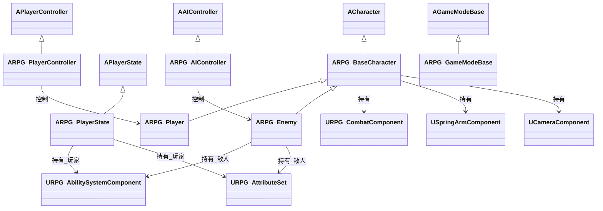
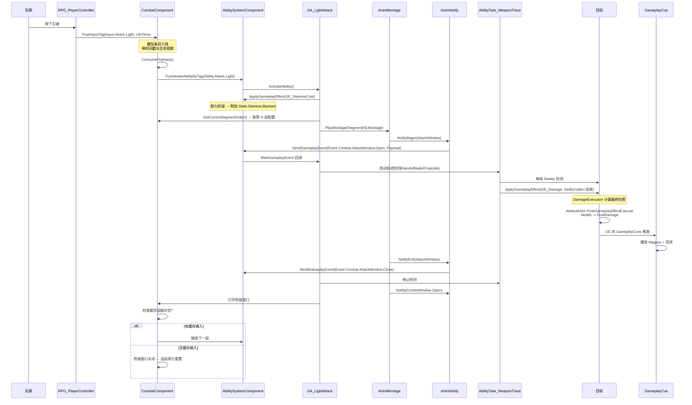

# RPG 项目架构设计文档

> UE 5.8 · 单机 ARPG · GAS 驱动 · 求职作品集
> 版本 v1.0 · 2026-09-11

---

## 目录

1. [设计目标与范围](#1-设计目标与范围)
2. [目录结构设计](#2-目录结构设计)
3. [类继承与依赖方向](#3-类继承与依赖方向)
4. [GAS 核心链路](#4-gas-核心链路)
5. [属性集与伤害计算](#5-属性集与伤害计算)
6. [GameplayTag 体系](#6-gameplaytag-体系)
7. [战斗系统设计](#7-战斗系统设计)
8. [动画系统设计](#8-动画系统设计)
9. [AI 系统设计](#9-ai-系统设计)
10. [接口层设计](#10-接口层设计)
11. [资产命名与 Content 规划](#11-资产命名与-content-规划)
12. [实施路线图](#12-实施路线图)
13. [面试技术亮点](#13-面试技术亮点)
14. [附录：待决策事项](#14-附录待决策事项)

---

## 1. 设计目标与范围

### 1.1 目标

做一个**能跑、能演示、能讲**的 ARPG 战斗原型。核心不是功能多，而是**每个系统都经得起追问**。

三个衡量标准：

| 维度 | 标准 |
|---|---|
| 可运行 | 打开工程 → PIE → 能操控角色跑跳、打出 5 段连击、闪避无敌、敌人会巡逻追击攻击 |
| 可讲解 | 每个设计能回答"为什么这么做"和"替代方案是什么" |
| 可扩展 | 加一把新武器只需新增 DataAsset，不改代码 |

### 1.2 明确不做（MVP 范围控制）

- ❌ **网络联机 / 复制**——所有 `GetLifetimeReplicatedProps` 相关的复制逻辑不写，但**保留正确的 ASC 归属设计**，将来要加联机不用重构
- ❌ **存档 / 关卡流程 / 任务系统**
- ❌ **格挡**——本期不做，架构预留 `State.Blocking` 标签位与 `GA_Block` 类名
- ❌ **复杂的 UI**——只做属性条 HUD
- ❌ **美术资源制作**——用引擎自带 Mannequin + 商城免费动画

> ⚠️ 关于"不做联机但保留正确设计"：ASC 放在 `PlayerState` 上而不是 `Character` 上，是**联机场景下的唯一正确解**。单机时放哪都行，但放 PlayerState 能让你在面试时讲清楚"为什么"——这是白送的分。同理，所有属性修改走 GE 而不是直接赋值，也是复制友好设计。

---

## 2. 目录结构设计

### 2.1 决策：Feature Folder 而非 Public/Private 镜像

UE 模块默认约定是 `Public/` 放对外头文件、`Private/` 放实现。我建议**放弃这个约定**，改用功能文件夹（`.h` 和 `.cpp` 放一起）。

| 方案 | 优点 | 缺点 |
|---|---|---|
| **A. Feature Folder**（推荐） | 一个功能一个文件夹，找 `GA_LightAttack` 就在 `AbilitySystem/Abilities/` 里一眼看到 `.h` 和 `.cpp`；文件夹即模块边界 | 不符合 UE 插件规范 |
| B. Public/Private 镜像 | 符合引擎规范，插件/多模块工程必需 | 找文件要在两个平行目录间跳；游戏模块并不对外暴露 API，隔离语义用不上 |

**为什么游戏模块不需要 Public/Private**：这套机制是为**插件和跨模块依赖**设计的——`Public/` 的头文件会被自动加入依赖方的 include 路径。单一游戏模块没有任何外部消费者，这个隔离是纯粹的负担。

> 注：Lyra 的 GameFeature 插件、以及社区主流的 GameplayAbilitySample 系列，都倾向功能文件夹。面试时如果你能讲出这个取舍，是加分的。

**需要配合的 `Build.cs` 改动**：

```csharp
// 让 #include "AbilitySystem/Abilities/RPG_GA_LightAttack.h" 这种从模块根开始的路径生效
PublicIncludePaths.Add(ModuleDirectory);
```

### 2.2 完整目录树

```
Source/RPG/
│
├── RPG.Build.cs
├── RPG.h / RPG.cpp                         模块入口
├── RPGModule.cpp                           
│
├── Core/                                   ── 游戏框架层：不属于任何具体玩法的骨架
│   ├── RPG_GameModeBase.h/.cpp             指定默认类、无网络
│   ├── RPG_PlayerState.h/.cpp              ★ 玩家 ASC 宿主
│   ├── RPG_PlayerController.h/.cpp         ★ 增强输入、输入标签路由
│   ├── RPG_GameplayTags.h/.cpp             ★ 全部原生 GameplayTag 的 C++ 声明
│   ├── RPG_LogChannels.h/.cpp              自定义日志类别
│   └── RPG_AssetManager.h/.cpp             资产加载（阶段 6 再加，先留空位）
│
├── Character/                              ── 角色层：表现与移动
│   ├── RPG_BaseCharacter.h/.cpp            ★ 弹簧臂/相机/移动/共用组件容器
│   ├── RPG_Player.h/.cpp                   ★ 玩家角色，输入转发
│   ├── RPG_Enemy.h/.cpp                    ★ 敌人角色，自持 ASC
│   └── RPG_CharacterTypes.h                角色相关枚举与结构体
│
├── AbilitySystem/                          ── GAS 层：能力的定义与执行
│   ├── RPG_AbilitySystemComponent.h/.cpp   ★ 扩展 ASC：输入标签→能力映射、标签计数
│   ├── RPG_AttributeSet.h/.cpp             ★ 敌我共用属性集
│   ├── RPG_AbilitySystemLibrary.h/.cpp     静态辅助：从任意 Actor 取 ASC
│   ├── RPG_AbilitySystemGlobals.h/.cpp     自定义 EffectContext（阶段 6）
│   │
│   ├── Abilities/                          ── 所有 GA
│   │   ├── RPG_GameplayAbilityBase.h/.cpp      基类：常用查询、蒙太奇播放入口
│   │   ├── RPG_GA_LightAttack.h/.cpp           ★ 5 段轻击连段
│   │   ├── RPG_GA_HeavyAttack.h/.cpp           ★ 3 段蓄力 + 切手技
│   │   ├── RPG_GA_Dodge.h/.cpp                 ★ 闪避 + 无敌帧
│   │   ├── RPG_GA_Sprint.h/.cpp                奔跑（持续消耗耐力）
│   │   ├── RPG_GA_Jump.h/.cpp                  跳跃（一次性消耗耐力）
│   │   ├── RPG_GA_StaminaRegen.h/.cpp          被动耐力恢复
│   │   ├── RPG_GA_Heal.h/.cpp                  回血（后续法术复用）
│   │   ├── RPG_GA_ApplyBuff.h/.cpp             加攻/加防
│   │   └── RPG_GA_Death.h/.cpp                 死亡表现
│   │
│   ├── Effects/                            ── 所有 GE 与执行计算
│   │   ├── RPG_DamageExecution.h/.cpp          ★ 伤害执行计算
│   │   ├── RPG_GE_Damage.h/.cpp                ★ 伤害 GE（挂 Execution）
│   │   ├── RPG_GE_InitAttributes.h/.cpp        初始属性
│   │   ├── RPG_GE_StaminaCost.h/.cpp           单次耐力消耗
│   │   ├── RPG_GE_StaminaDrain.h/.cpp          持续耐力消耗
│   │   ├── RPG_GE_StaminaRegenDelay.h/.cpp     ★ 恢复阻断（纯标签实现）
│   │   ├── RPG_GE_StaminaRegen.h/.cpp          周期性恢复
│   │   ├── RPG_GE_Heal.h/.cpp                  回血
│   │   ├── RPG_GE_Buff_AttackUp.h/.cpp         攻击增益
│   │   ├── RPG_GE_Debuff_DefenseDown.h/.cpp    防御减益
│   │   ├── RPG_GE_Invulnerable.h/.cpp          ★ 无敌帧标签载体
│   │   └── RPG_GE_Cooldown.h/.cpp              通用冷却
│   │
│   ├── Cues/                               ── GameplayCue
│   │   ├── RPG_GameplayCueNotify_HitImpact.h/.cpp   受击特效音效
│   │   ├── RPG_GameplayCueNotify_Dodge.h/.cpp
│   │   └── RPG_GameplayCueNotify_Buff.h/.cpp
│   │
│   └── Tasks/                              ── 自定义 AbilityTask
│       ├── RPG_AbilityTask_WeaponTrace.h/.cpp     ★ 武器轨迹检测
│       └── RPG_AbilityTask_WaitInputBuffer.h/.cpp 等待输入缓存（可选）
│
├── Combat/                                 ── 战斗层：不依赖 GAS 的纯战斗逻辑
│   ├── RPG_CombatComponent.h/.cpp          ★ 输入缓存标签容器 + 连段状态机
│   ├── RPG_InputBuffer.h/.cpp              ★ 缓存容器（可独立单测）
│   ├── RPG_CombatTypes.h                   攻击枚举、缓存条目结构
│   ├── RPG_AttackModuleData.h/.cpp         ★ PrimaryDataAsset 攻击模组
│   ├── RPG_AttackTypes.h                   攻击段结构体
│   ├── RPG_Projectile.h/.cpp               远程发射物
│   └── RPG_TargetingLibrary.h/.cpp         检测辅助（球扫/胶囊扫封装）
│
├── Input/                                  ── 输入层：只做映射，不做逻辑
│   ├── RPG_InputConfig.h/.cpp              ★ PrimaryDataAsset: InputAction ↔ GameplayTag
│   └── RPG_InputComponent.h/.cpp           输入转发组件（可选，阶段 6）
│
├── Interfaces/                             ── 接口层：跨层查询契约
│   ├── RPG_AbilitySystemInterface.h        ★ 统一 GetAbilitySystemComponent
│   └── RPG_CombatInterface.h               战斗能力查询（攻击模组、是否可被攻击）
│
├── Animation/                              ── 动画层：C++ 只负责桥接，蓝图负责状态机
│   ├── RPG_AnimInstanceBase.h/.cpp         ★ 从 ASC 读取状态标签供蓝图使用
│   └── Notifies/
│       ├── RPG_AnimNotify_AttackWindow.h/.cpp       ★ 开启伤害窗口
│       ├── RPG_AnimNotify_ComboWindow.h/.cpp        ★ 开启衔接窗口
│       ├── RPG_AnimNotify_Invulnerability.h/.cpp    ★ 无敌帧
│       ├── RPG_AnimNotify_ConsumeStamina.h/.cpp     动画驱动耐力消耗
│       ├── RPG_AnimNotify_AttackEnd.h/.cpp          攻击段结束
│       └── RPG_AnimNotify_SendGameplayEvent.h/.cpp  通用事件广播
│
├── AI/                                     ── AI 层
│   ├── RPG_AIController.h/.cpp             ★ 感知 + 黑板 + 行为树
│   ├── Tasks/
│   │   ├── BTTask_RPG_Patrol.h/.cpp            巡逻
│   │   ├── BTTask_RPG_MoveToTarget.h/.cpp      追击
│   │   └── BTTask_RPG_Attack.h/.cpp            ★ 触发攻击 GA 并等待结束
│   ├── Services/
│   │   └── BTService_RPG_PerceptionUpdate.h/.cpp   更新目标信息到黑板
│   └── Decorators/
│       └── BTDecorator_RPG_CanAttack.h/.cpp        攻击冷却与状态检查
│
└── UI/                                     ── UI 层
    ├── RPG_HUDWidget.h/.cpp
    └── RPG_AttributeBarWidget.h/.cpp
```

★ = 核心文件，优先实现

### 2.3 分层依赖规则

```
        UI  ──────────────┐
                          ↓
   AI ──→ Combat ──→ AbilitySystem ──→ Core
   │         │              │
   └─────────┴──→ Character ┘
                          ↑
                    Animation / Input
```

**硬性规则**（违反会导致编译依赖环）：

1. `Core` 不依赖任何游戏层（只依赖引擎）
2. `AbilitySystem` 可以依赖 `Combat` 的**数据结构**，但 `Combat` 不能反向依赖 `AbilitySystem` 的 GA/GE
   - 例外：`CombatComponent` 需要触发能力 → 通过 `UAbilitySystemBlueprintLibrary` 或接口调用，不直接 `#include` 具体 GA 类
3. `Animation` 只做桥接，不包含战斗逻辑（判定、伤害计算一律不放 Notify 里）
4. `Interfaces` 是叶子节点，被所有人依赖，自己不依赖别人

> 💡 第 3 条特别重要，也是常见的面试陷阱。很多人会把"扣血"写在 AnimNotify 里——那样动画和数值就耦合死了，改数值要动动画资源，且无法单元测试。**Notify 只广播事件，GA 决定后果。**

---

## 3. 类继承与依赖方向

### 3.1 角色继承体系



### 3.2 各角色职责

| 类 | 职责 | 明确不负责 |
|---|---|---|
| `ARPG_BaseCharacter` | 弹簧臂、相机、移动参数配置、`CombatComponent` 与 `AnimInstanceBase` 的持有、ASC 接口的**默认实现**（转发给子类） | 具体输入绑定（→PlayerController）、ASC 的创建（→子类/PlayerState） |
| `ARPG_Player` | 输入转发入口（由 PC 调用）、玩家特有的表现 | 输入绑定本身、ASC 创建 |
| `ARPG_Enemy` | **创建并持有自己的 ASC 与 AttributeSet**、AI 相关数据（巡逻点等） | 行为树逻辑（→AIController/BTTask） |
| `ARPG_PlayerController` | **全部输入绑定**（增强输入）、输入标签推入缓存、UI 输入模式 | 直接操作 ASC 执行能力 |
| `ARPG_PlayerState` | **创建并持有玩家的 ASC 与 AttributeSet** | 任何表现层逻辑 |
| `ARPG_AIController` | 感知组件、黑板、行为树运行 | 具体行为（→BTTask） |

> **为什么玩家的 ASC 不放 Character？**
> 三个理由，面试可直接讲：
> 1. **死亡与重生**：角色死亡时 Character 会被销毁，如果 ASC 在上面，技能冷却、Buff 剩余时间、属性全丢。放 PlayerState 上，重生后状态延续。
> 2. **复制友好**：`PlayerState` 是网络复制中天然跟随玩家的 Actor，ASC 需要复制时挂它下面最省事（本项目不做联机，但设计对齐标准做法）。
> 3. **逻辑归属**：ASC 的 `OwnerActor` 是"这个能力属于谁"的逻辑答案，`AvatarActor` 是"这个能力通过什么身体表现"的答案。玩家死后还可以有 Owner（魂），但不一定有 Avatar（身体）。
>
> 敌人为什么反过来放自己身上？因为敌人的生命周期和自己的 ASC 完全一致——死了一起销毁，没有重生需求，也没有跨 Actor 的状态延续问题。

---

## 4. GAS 核心链路

### 4.1 链路总览

严格遵循你要求的四段式：

```
[1] ASC 初始化        [2] 触发 GA           [3] GE 上 Buff/标签      [4] GC 播特效音效
─────────────────    ─────────────────    ─────────────────────    ──────────────────
InitAbilityActorInfo  TryActivateAbility   ApplyGameplayEffectTo    GE 携带 GameplayCues
GiveStartupAbilities  by Tag / by Class    Target / Self            数组
ApplyInitAttributes   ↓                  ↓                        ↓
                      GA 执行逻辑         AttributeSet 修改          GameplayCueNotify
                      (播放蒙太奇/检测)    → PostGameplayEffect      → Niagara + 音效
                                          Execute → 广播委托
```

### 4.2 玩家 ASC 初始化时序

```
① ARPG_GameModeBase 指定 DefaultPawnClass / PlayerStateClass / PlayerControllerClass

② ARPG_PlayerController::BeginPlay
     └─ 添加 IMC_RPG_Default 到 EnhancedInputSystem

③ ARPG_Player 被 Controller 占有 → PossessedBy(AController*)
     └─ InitAbilityActorInfo()
           ├─ ASC = PlayerState->GetAbilitySystemComponent()
           ├─ AttributeSet = PlayerState->GetAttributeSet()
           ├─ ASC->InitAbilityActorInfo(PlayerState, this)
           │     OwnerActor = PlayerState  ← 能力归属
           │     AvatarActor = this        ← 表现载体
           ├─ ASC->AddLooseGameplayTags(初始状态标签)
           ├─ GiveStartupAbilities()       ← 授予初始能力
           └─ ApplyInitAttributes()        ← 应用 GE_InitAttributes

④ ARPG_PlayerState 在更早的时机（如 ClientInit / BeginPlay）已完成：
     ├─ ASC = CreateDefaultSubobject<URPG_AbilitySystemComponent>()
     ├─ AttributeSet = CreateDefaultSubobject<URPG_AttributeSet>()
     ├─ ASC->AddAttributeSetSubobject(AttributeSet)
     └─ ASC->SetIsReplicated(true)    ← 单机也设，表达意图
```

> ⚠️ **顺序陷阱**：`PossessedBy` 在 `PlayerState` 尚未完全初始化时可能被调用（联机下尤其）。标准解法是在 `ARPG_Player::BeginPlay` 或 `OnRep_PlayerState` 里做一次 `InitAbilityActorInfo` 的**幂等重入**。本项目单机，但我会写成幂等的，并在注释里说明原因。

### 4.3 敌人 ASC 初始化时序

```
ARPG_Enemy::BeginPlay / PossessedBy
  ├─ ASC = CreateDefaultSubobject<URPG_AbilitySystemComponent>(this)
  ├─ AttributeSet = CreateDefaultSubobject<URPG_AttributeSet>(this)
  ├─ ASC->AddAttributeSetSubobject(AttributeSet)
  ├─ ASC->InitAbilityActorInfo(this, this)   ← Owner == Avatar == Enemy
  ├─ GiveStartupAbilities()
  └─ ApplyInitAttributes()
```

### 4.4 一次完整攻击的链路（核心时序图）



### 4.5 关键设计：AnimNotify 如何与 GA 通信

这是整个战斗系统的**枢纽**，有三种做法：

| 方案 | 做法 | 评价 |
|---|---|---|
| A. Notify 直接找 GA 调用方法 | `Cast<URPG_GA_LightAttack>(...)` → 调用 | ❌ 强耦合，GA 换类型就崩 |
| B. Notify 调 CombatComponent | Notify → `CombatComponent->OnAttackWindowBegin()` → 组件再通知 GA | ⚠️ 可行，但绕过了 GAS 的事件体系，调试时在 GAS 日志里看不到 |
| **C. Notify 发 GameplayEvent**（推荐） | `UAbilitySystemBlueprintLibrary::SendGameplayEventToActor(Tag, Payload)`，GA 用 `WaitGameplayEvent` 接收 | ✅ 解耦、可被任意能力监听、`GameplayDebugger` 里可追踪、符合 GAS 设计意图 |

**选 C**。

> ⚠️ **UE 5.8 实测修正（重要）**
> 网上大量 GAS 教程用的 `UAbilityTask_PlayMontageAndWaitForEvent` 在 5.8 引擎里**根本不存在**——
> 全 Engine 源码检索 0 命中。它是 UE4 时代社区插件里的类，被无数博客当成标准写法转载。
> 5.8 只有 `UAbilityTask_PlayMontageAndWait`，而它的委托（`OnCompleted` / `OnBlendOut` /
> `OnInterrupted` / `OnCancelled`）**不带任何参数**，收不到事件数据。
> 所以"播动画"和"收事件"必须拆成**两个 Task**。

正确写法：

```cpp
// ── ① 播蒙太奇：只负责动画播放与结束/打断通知 ──
UAbilityTask_PlayMontageAndWait* MontageTask =
    UAbilityTask_PlayMontageAndWait::CreatePlayMontageAndWaitProxy(
        this, NAME_None, MontageToPlay,
        /*Rate*/ 1.f, /*StartSection*/ NAME_None, /*bStopWhenAbilityEnds*/ true);
MontageTask->OnCompleted.AddDynamic(this, &URPG_GA_LightAttack::OnMontageCompleted);
MontageTask->OnInterrupted.AddDynamic(this, &URPG_GA_LightAttack::OnMontageInterrupted);
MontageTask->ReadyForActivation();

// ── ② 收事件：监听 AnimNotify 广播出来的 GameplayEvent ──
// 每个关心的事件单独建一个 Task，用确切的 Tag 过滤，比"全收再分发"更清晰也更快
auto BindEventTask = [this](FGameplayTag EventTag, auto Func)
{
    UAbilityTask_WaitGameplayEvent* T =
        UAbilityTask_WaitGameplayEvent::WaitGameplayEvent(this, EventTag);
    T->EventReceived.AddDynamic(this, Func);
    T->ReadyForActivation();
};

BindEventTask(RPGTags::Event_Combat_AttackWindow_Open,  &URPG_GA_LightAttack::OnAttackWindowOpen);
BindEventTask(RPGTags::Event_Combat_ComboWindow_Open,   &URPG_GA_LightAttack::OnComboWindowOpen);
BindEventTask(RPGTags::Event_Combat_AttackEnd,          &URPG_GA_LightAttack::OnAttackEnd);

void URPG_GA_LightAttack::OnAttackWindowOpen(FGameplayEventData Payload)
{
    // Payload.OptionalObject 里装着 AnimNotify 打包好的"单次攻击信息"
    StartWeaponTrace(Payload);
}
```

> 💡 **两个必须记住的 5.8 细节**：
> 1. `UAbilityTask_WaitGameplayEvent::WaitGameplayEvent` 的签名是
>    `(UGameplayAbility*, FGameplayTag EventTag, AActor* OptionalExternalTarget = nullptr, bool OnlyTriggerOnce = false, bool OnlyMatchExact = true)`。
>    默认 `OnlyMatchExact = true` 是**精确匹配**——想接收某个事件的所有子标签，必须显式传 `false`。
> 2. `EndAbility` 在 5.8 是 **protected 且两个 bool 无默认值**，必须写全：
>    `EndAbility(CurrentSpecHandle, CurrentActorInfo, CurrentActivationInfo, /*bReplicateEndAbility*/ true, /*bWasCancelled*/ false);`
>
> 两个 Task 都必须在 `ActivateAbility` 里创建并 `ReadyForActivation()`。它们随 GA 结束自动销毁——`UAbilityTask` 的生命周期绑在 OwningAbility 上，不需要手动清理。

> 💡 **Payload 里带什么**：`FGameplayEventData` 有 `OptionalObject` / `OptionalObject2` / `ContextHandle` / `TargetData` 等字段。把"单次攻击信息"（伤害倍率、检测源类型、检测半径）打包成一个 `UObject`（如 `URPG_AttackWindowPayload`）塞进 `OptionalObject`，GA 侧取出来用。这样 Notify 上配置不同参数就能驱动不同段的攻击，无需为每段写一个 GA。

---

## 5. 属性集与伤害计算

### 5.1 属性清单

| 属性 | 分类 | 初始值 | 说明 |
|---|---|---|---|
| `MaxHealth` | Health | 100 | 最大生命值 |
| `Health` | Health | 100 | 当前生命值 |
| `Attack` | Combat | 10 | 攻击力（伤害计算的基数） |
| `Defense` | Combat | 10 | 防御值（参与减伤计算） |
| `MaxMana` | Mana | 100 | 最大法力值 |
| `Mana` | Mana | 100 | 当前法力值（3 个法术消耗） |
| `MaxStamina` | Stamina | 100 | 最大耐力值 |
| `Stamina` | Stamina | 100 | 当前耐力值 |
| `IncomingDamage` | Meta | — | **元属性**，伤害中转站，不实际存储 |

**为什么要有 `IncomingDamage` 元属性？**
它是伤害的"入口"。执行计算把最终伤害写进它，然后在 `PostGameplayEffectExecute` 里统一处理：

```
Execution 计算出 FinalDamage
  → 写入 IncomingDamage（元属性）
  → PostGameplayEffectExecute 捕获
      ├─ 检查 State.Invulnerable → 直接清零
      ├─ 检查 State.Blocking → 减伤
      ├─ Health -= IncomingDamage（并 clamp）
      ├─ 把 IncomingDamage 清零（元属性复位）
      ├─ 广播 OnHealthChanged 委托（UI 更新）
      └─ Health <= 0 → 广播 OnDeathStarted
```

好处：**所有伤害后处理集中在一个地方**。将来加格挡、闪避反击、伤害飘字、吸血，都只改这一处，不用碰 Execution 和各种 GE。

### 5.2 伤害计算公式

```
【攻击方】
  BaseDamage        = Attacker.Attack × AttackMultiplier
                      ↑ 已含 Buff（GE 修饰符在属性层生效）
  AttackMultiplier  = SetByCaller(Data.Damage.Multiplier)   ← 来自攻击模组配置

【目标方】
  Defense           = Target.Defense
                      ↑ 已含 Debuff
  Mitigation        = Defense / (Defense + DefenseConstant)
                      DefenseConstant 默认 100（可配）
  FinalDamage       = BaseDamage × (1 - Mitigation)
  FinalDamage       = max(FinalDamage, MinDamage)   ← 保底伤害，默认 1

【后处理】
  if (Target 有 State.Invulnerable) FinalDamage = 0
```

**为什么用除法而不是减法？**

| 公式 | 问题 |
|---|---|
| `Damage - Defense` | 防御堆到攻击力以上 → 伤害归零/负数，数值策划噩梦 |
| `Damage × (1 - Defense%)` | 防御百分比堆到 100% → 无敌 |
| **`Defense / (Defense + K)`**（推荐） | 收益递减，永远不会到 100%；K 是"减伤 50% 所需的防御值"，直观可调 |

举例（K=100）：防御 10 → 减伤 9%；防御 100 → 减伤 50%；防御 300 → 减伤 75%。曲线平滑，符合直觉。

> 💡 **关键理解**：Buff/Debuff **不需要在 Execution 里手动遍历**。因为 `Attack` / `Defense` 是 AttributeSet 上的属性，而 Buff 是通过 GE 的 Modifier 修改这些属性的——Execution 捕获到的是**已经被所有 GE 修改过后的当前值**。这就是"综合防御值、buff、debuff"的实现方式。面试时讲清楚这点，说明你真的理解 GAS 的属性管线，而不是把它当黑盒。

### 5.3 Execution 捕获定义

```cpp
// 在 URPG_DamageExecution 构造函数中静态声明捕获
struct FRPGDamageStatics
{
    DECLARE_ATTRIBUTE_CAPTUREDEF(Attack);
    DECLARE_ATTRIBUTE_CAPTUREDEF(Defense);
    DECLARE_ATTRIBUTE_CAPTUREDEF(IncomingDamage);
    // ...
};

// 关键点：
// Attack  → Source（快照 or 非快照）
// Defense → Target
// IncomingDamage → Target
```

**Snapshot vs Non-Snapshot 的取舍**（面试常问）：

| 类型 | 行为 | 适用 |
|---|---|---|
| `Snapshot = true` | 在 GE **应用瞬间**捕获属性值，之后属性变化不影响本次计算 | 伤害、治疗等"一次性结算" |
| `Snapshot = false` | 在 GE **执行瞬间**捕获当前值 | 持续型效果、需要实时反映状态的计算 |

伤害计算用 **Snapshot**：玩家按下攻击键那一刻的 Attack 应该被"锁定"，否则飞行道具在途中玩家吃了减攻 Debuff，伤害会莫名变化——手感上很怪。

### 5.4 耐力系统设计

这是你要求里最细的部分，单独拆解。

**消耗规则表**：

| 行为 | 类型 | 消耗（示例值，可配） |
|---|---|---|
| 轻击（每段） | 单次 | 8 |
| 重击 Lv1 / Lv2 / Lv3 | 单次 | 15 / 20 / 25 |
| 闪避 | 单次 | 20 |
| 跳跃 | 单次 | 10 |
| 奔跑 | 持续 | 5 / 秒 |
| 重击蓄力中 | 持续 | 10 / 秒 |

**恢复规则**：
- 最后一次消耗后 **3 秒内不恢复**
- 3 秒后以固定速率缓慢恢复（示例 15 / 秒）
- 持续消耗期间（奔跑/蓄力）同样不恢复

**实现方案：纯标签驱动，零 C++ 逻辑**

```
[单次消耗]
  GE_StaminaCost  (Instant)
     Modifier: Stamina, Additive, SetByCaller(Data.Stamina.Cost) × -1
     → PostGameplayEffectExecute 检测到 Stamina 减少
     → Apply GE_StaminaRegenDelay 给自身

[持续消耗]
  GE_StaminaDrain  (Duration, Period = 0.1s)
     Modifier: Stamina, Additive, SetByCaller(Data.Stamina.Rate) × -0.1
     → 由 GA_Sprint / GA_HeavyAttack(蓄力中) 施加，结束/松开时移除
     → 同样刷新 RegenDelay

[恢复阻断]
  GE_StaminaRegenDelay  (Duration = 3.0s)
     + TargetTags 组件: 授予 State.Stamina.Blocked
     Stacking: 每次应用刷新持续时间 (Refresh)

[恢复]
  GE_StaminaRegen  (Infinite, Period = 0.25s)
     Modifier: Stamina, Additive, +3.75 (即 15/秒)
     + TargetTagRequirements 组件:
          OngoingTagRequirements.IgnoreTags = [State.Stamina.Blocked]
          ← 有这个标签时效果被抑制
```

**关键点**：`GA_StaminaRegen` 是一个**被动能力**，只在角色初始化时激活一次，然后 `GE_StaminaRegen` 就一直挂在身上。恢复的开关完全由 `State.Stamina.Blocked` 标签控制——**不需要任何 Tick 逻辑、不需要计时器、不需要 C++ 判断**。

> 💡 这是 GAS 的精髓：**用标签表达状态，用 OngoingTagRequirements 表达状态依赖**。面试时如果你能对比"用 SetTimer 手写恢复逻辑"vs"用 OngoingTagRequirements"，并说出后者在联机下天然正确、在 GameplayDebugger 里可见、且策划可自行调整，这题就满分了。

> ⚠️ **UE 5.8 实测修正（重要）**
> `UGameplayEffect::OngoingTagRequirements` / `ApplicationTagRequirements` / `RemovalTagRequirements` /
> `InheritableOwnedTagsContainer` / `GrantedAbilities` / `UIData` 等一批内联字段，**在 5.3 就被标记
> UE_DEPRECATED**，5.8 里全部改成了 **GameplayEffectComponent 组件**形式（`UGameplayEffect` 现在有个
> `GEComponents` 数组，Categories = "Components"）。用旧字段会直接产生编译警告，且编辑器 Details 面板里
> 根本找不到那些栏位。
>
> | 废弃的内联字段 | 5.8 的替代组件 |
> |---|---|
> | `OngoingTagRequirements` / `ApplicationTagRequirements` / `RemovalTagRequirements` | `UTargetTagRequirementsGameplayEffectComponent`（三个同名字段） |
> | `InheritableOwnedTagsContainer`（授予目标标签） | `UTargetTagsGameplayEffectComponent` |
> | `InheritableGameplayEffectTags`（GE 自身资产标签） | `UAssetTagsGameplayEffectComponent` |
> | `InheritableBlockedAbilityTagsContainer` | `UBlockAbilityTagsGameplayEffectComponent` |
> | `GrantedAbilities` | `UAbilitiesGameplayEffectComponent` |
> | `UIData` | `UGameplayEffectUIData`（现在也是组件） |
> | `RemoveGameplayEffectQuery` 等移除类 | `URemoveOtherGameplayEffectComponent` |
> | `GrantedApplicationImmunityTags` | `UImmunityGameplayEffectComponent` |
> | `StackingType`（**5.7** 废弃） | `GetStackingType()` 访问器 |
>
> **好消息**：`GameplayCues`（`TArray<FGameplayEffectCue>`）、`Modifiers`、`Executions`、
> `DurationPolicy`、`DurationMagnitude`、`Period`、`StackLimitCount`、`StackDurationRefreshPolicy`
> 这些**都还健在**，没有变成组件——所以 GC 那条链路不受影响。
>
> **编辑器操作**：选中 GE 资产 → Details 面板 → 找到 **Components** 数组 → `+` → 选择组件类型。
> **C++ 动态构建 GE**：`GE->FindOrAddComponent<UTargetTagRequirementsGameplayEffectComponent>()`。
> （native GE 类里则是在构造函数中 `CreateDefaultSubobject` 后加入 `GEComponents`，注意该数组成员是 protected。）

### 5.5 回血与增益

| GE | 类型 | 修改 | 用途 |
|---|---|---|---|
| `GE_Heal` | Instant | `Health` Additive, SetByCaller 或固定值 | 回血药、治疗法术 |
| `GE_Buff_AttackUp` | Duration (15s) | `Attack` Additive +20% | 加攻 Buff |
| `GE_Debuff_DefenseDown` | Duration (10s) | `Defense` Multiplicative -0.3 | 减防 Debuff |

由 `GA_Heal` / `GA_ApplyBuff` 施加，GC 播放对应特效音效。

---

## 6. GameplayTag 体系

### 6.1 命名规范

```
<域>.<类别>.<子类别>.<具体>
```

- 域：`Ability` / `Input` / `State` / `Event` / `Data` / `Cooldown` / `GameplayCue` / `Attack` / `Damage`
- 全部用**单数名词**、**大驼峰**
- 层级深度不超过 5 段

### 6.2 完整标签清单

```
├─ Ability
│   ├─ Ability.Attack.Light
│   ├─ Ability.Attack.Heavy
│   ├─ Ability.Dodge
│   ├─ Ability.Sprint
│   ├─ Ability.Jump
│   ├─ Ability.Heal
│   ├─ Ability.Buff.AttackUp
│   ├─ Ability.StaminaRegen          (被动)
│   ├─ Ability.Death                 (被动)
│   └─ Ability.Spell.1 / .2 / .3     (黑神话式三法术，后续)
│
├─ Input
│   ├─ Input.Attack.Light
│   ├─ Input.Attack.Heavy
│   ├─ Input.Dodge
│   ├─ Input.Sprint
│   ├─ Input.Jump
│   ├─ Input.Crouch
│   └─ Input.Spell.1 / .2 / .3
│
├─ State
│   ├─ State.Attack.Windup          前摇
│   ├─ State.Attack.Active          伤害窗口（检测开启）
│   ├─ State.Attack.Recovery        后摇
│   ├─ State.Attack.ComboWindow     衔接窗口
│   ├─ State.Attack.Charging        蓄力中
│   ├─ State.Attack.Charging.Lv1 / .Lv2 / .Lv3
│   ├─ State.Dodging
│   ├─ State.Invulnerable           ★ 无敌帧
│   ├─ State.Sprinting
│   ├─ State.Blocking               (预留，下期)
│   ├─ State.Dead
│   ├─ State.Stamina.Blocked        ★ 恢复阻断
│   └─ State.Combat.InCombat
│
├─ Event
│   ├─ Event.Combat.AttackWindow.Open / .Close
│   ├─ Event.Combat.ComboWindow.Open / .Close
│   ├─ Event.Combat.AttackEnd
│   ├─ Event.Combat.Hit
│   ├─ Event.Combat.Death
│   ├─ Event.Combat.ChargeStart / .ChargeLevelUp / .ChargeRelease
│   ├─ Event.Character.Invulnerability.Begin / .End
│   └─ Event.Character.StaminaCost
│
├─ Data                          (SetByCaller 用的数据标签)
│   ├─ Data.Damage.Multiplier
│   ├─ Data.Damage.Base
│   ├─ Data.Stamina.Cost
│   ├─ Data.Stamina.Rate
│   └─ Data.Heal.Amount
│
├─ Cooldown
│   ├─ Cooldown.Attack.Light
│   ├─ Cooldown.Attack.Heavy
│   └─ Cooldown.Dodge
│
├─ Attack.Module                 (攻击模组标识)
│   ├─ Attack.Module.Unarmed
│   ├─ Attack.Module.Melee
│   └─ Attack.Module.Ranged
│
└─ GameplayCue
    ├─ GameplayCue.Combat.Hit
    ├─ GameplayCue.Combat.HeavyHit
    ├─ GameplayCue.Combat.Death
    ├─ GameplayCue.Character.Dodge
    ├─ GameplayCue.Character.Heal
    └─ GameplayCue.Character.Buff
```

### 6.3 声明方式

**C++ 侧**（`Core/RPG_GameplayTags.h`）：

```cpp
// UE 5.3+ 推荐写法：编译期声明，自动注册到标签表
UE_DECLARE_GAMEPLAY_TAG_EXTERN(Input_Attack_Light);
UE_DECLARE_GAMEPLAY_TAG_EXTERN(State_Invulnerable);
// ...

// .cpp 中定义
UE_DEFINE_GAMEPLAY_TAG_COMMENT(Input_Attack_Light, "Input.Attack.Light", "玩家轻击输入");
UE_DEFINE_GAMEPLAY_TAG_COMMENT(State_Invulnerable, "State.Invulnerable", "无敌帧期间持有");
```

**为什么用 C++ 而不是纯 `.ini` 配置？**

| 方式 | 优点 | 缺点 |
|---|---|---|
| `DefaultGameplayTags.ini` | 策划可视化编辑 | C++ 里只能用 `RequestGameplayTag(FName("..."))`，拼错字符串编译期不报错，运行时才崩 |
| **C++ `UE_DEFINE_GAMEPLAY_TAG`**（推荐） | 编译期检查、IDE 可跳转、重构安全 | 改标签要重新编译 |

实际项目通常**混合**：核心流程标签用 C++ 定义（保证安全），玩法/内容标签用 ini（保证灵活）。本项目核心标签全部走 C++。

> ⚠️ 注意：`UE_DEFINE_GAMEPLAY_TAG` 需要模块依赖 `GameplayTags`，且这些标签会在模块加载时自动注册，**不再需要手动写 ini**。

---

## 7. 战斗系统设计

### 7.1 输入缓存标签容器

**需求回顾**：按下左/右键 → 对应输入标签存入缓存容器 → 每个标签有生命周期 → 容器非空时移除栈顶标签并执行对应操作。

**数据结构**：

```cpp
USTRUCT(BlueprintType)
struct FRPG_BufferedInput
{
    GENERATED_BODY()

    UPROPERTY(BlueprintReadOnly) FGameplayTag InputTag;      // Input.Attack.Light 等
    UPROPERTY(BlueprintReadOnly) float      Timestamp;       // 入队时的世界时间
    UPROPERTY(BlueprintReadOnly) float      LifeTime;        // 生命周期（秒）
    UPROPERTY(BlueprintReadOnly) int32      ComboHint;       // 保留字段：意图段数

    bool IsExpired(float Now) const { return (Now - Timestamp) > LifeTime; }
};

UCLASS()
class URPG_InputBuffer : public UObject
{
    GENERATED_BODY()

public:
    static constexpr int32 MaxEntries = 4;      // 容量上限，防狂按堆积

    void Push(const FGameplayTag& Tag, float LifeTime);
    bool ConsumeTop(FRPG_BufferedInput& Out);   // 移除栈顶（LIFO）
    void PruneExpired(float Now);               // 清理超时条目
    void Clear();
    bool IsEmpty() const;
    int32 Num() const;

private:
    UPROPERTY() TArray<FRPG_BufferedInput> Entries;   // 末尾 = 栈顶
};
```

**生命周期处理（三个关键点）**：

1. **超时清理**：每次 Push / ConsumeTop 前先 `PruneExpired`。不用 Timer——因为容器只在输入和消耗两个时刻被访问，惰性清理足够且无额外开销。
2. **容量上限**：超过 `MaxEntries` 时**丢弃最旧的**（`RemoveAt(0)`）。理由：玩家最新按下的输入才代表当前意图，丢弃旧输入比拒绝新输入手感更好。
3. **生命周期取值**：建议 `0.4~0.6 秒`。太短 → 玩家在硬直中提前按的输入会丢，感觉"不跟手"；太长 → 玩家乱按后角色会自己动，感觉"失控"。

**LIFO vs FIFO —— 你要求的是栈顶（LIFO），我实现 LIFO，但这里有个值得知道的取舍**：

| 模式 | 行为 | 手感 |
|---|---|---|
| **LIFO（栈，你指定）** | 移除最后压入的 | 玩家连按"左左右"时，先执行最后的"右"——**尊重最新意图** |
| FIFO（队列） | 移除最早压入的 | 按顺序依次执行，符合"输入排队"直觉 |

单键连打时两者**完全等价**（都是同一个标签）。差异只在混合输入（轻击+闪避+重击）时体现。我会在 `URPG_CombatComponent` 上留一个 `ERPG_InputBufferMode` 枚举，默认 `Stack`，方便你实测两种手感后再定。

### 7.2 连段状态机

```
                    ┌──────────────────────────────────────────┐
                    ↓                                          │
                 [Idle]                                        │
                    │ 轻击输入 & 容器有货                      │
                    ↓                                          │
            [Attacking: Segment N]                             │
                    │                                          │
        ┌───────────┴───────────┐                              │
        │ 伤害窗口开启          │ 伤害窗口关闭                  │
        ↓                       ↓                              │
   [Active 检测中]         [Recovery 后摇]                      │
                                │                              │
                    ┌───────────┴───────────┐                  │
                    │ ComboWindow 开启      │ 窗口关闭          │
                    ↓                       ↓                  │
            [等待输入]                  [连段重置] ─────────────┘
                    │                                          │
                    │ 容器非空 → ConsumeTop → N+1 ≤ 5          │
                    └──────────────────────────────────────────┘
```

**连段索引的重置时机**是最容易做错的地方。三种做法：

- ❌ GA 结束时重置 → 玩家永远连不上第二段
- ❌ 蒙太奇播完重置 → 同上
- ✅ **衔接窗口关闭时仍未消耗到输入 → 重置**（正确）

### 7.3 攻击模组 DataAsset

```cpp
UCLASS(BlueprintType)
class URPG_AttackModuleData : public UPrimaryDataAsset
{
    GENERATED_BODY()
public:
    UPROPERTY(EditDefaultsOnly, Category="Module")
    ERPG_AttackModuleType ModuleType;                  // Unarmed / Melee / Ranged

    UPROPERTY(EditDefaultsOnly, Category="Module")
    FGameplayTag ModuleTag;                            // Attack.Module.Unarmed

    // ── 轻击：5 段 ──
    UPROPERTY(EditDefaultsOnly, Category="Light")
    TArray<FRPG_AttackSegment> LightAttacks;

    // ── 重击：3 段蓄力 ──
    UPROPERTY(EditDefaultsOnly, Category="Heavy")
    FRPG_HeavyAttackSet HeavyAttack;

    // ── 切手技（轻击连段中按右键切入）──
    UPROPERTY(EditDefaultsOnly, Category="Transition")
    TObjectPtr<UAnimMontage> ComboTransitionMontage;
};

USTRUCT(BlueprintType)
struct FRPG_AttackSegment
{
    GENERATED_BODY()

    UPROPERTY(EditDefaultsOnly) TObjectPtr<UAnimMontage> Montage;
    UPROPERTY(EditDefaultsOnly) float DamageMultiplier = 1.0f;
    UPROPERTY(EditDefaultsOnly) float StaminaCost      = 8.0f;
    UPROPERTY(EditDefaultsOnly) ERPG_TraceSource TraceSource = ERPG_TraceSource::Hands;
    UPROPERTY(EditDefaultsOnly) float TraceRadius      = 30.0f;
    UPROPERTY(EditDefaultsOnly) FGameplayTag AttackTag;   // 供 AnimNotify 广播区分
};
```

**数值表**：

| 段数 | 轻击倍率 | 重击（蓄力段） | 重击倍率 |
|---|---|---|---|
| 1 | 1.0 | Lv1 | 3.0 |
| 2 | 1.15 | Lv2 | 4.5 |
| 3 | 1.4 | Lv3 | 6.5 |
| 4 | 1.6 | | |
| 5 | 2.0 | | |

> 💡 **为什么用 DataAsset 而不是 DataTable？** DataTable 适合"几百行同构数据"（比如掉落表）；攻击模组是**少量、结构复杂、含软引用**的配置，DataAsset 的优势是：可以在编辑器里直接拖蒙太奇、可以嵌套子结构、可以做资产引用校验、可以继承。而且 `UPrimaryDataAsset` 配合 `AssetManager` 能做异步加载，是大项目标准做法。

**加一把新武器需要做什么？** 新建一个 `DA_AttackModule_Katana`，填 5 个蒙太奇 + 倍率，挂到角色上。**零代码改动**——这就是数据驱动。

### 7.4 三种检测源

| 模组 | 检测源 | 实现 |
|---|---|---|
| 徒手 | 双手骨骼 | 每帧采样 `hand_l` / `hand_r` 骨骼位置，与上一帧位置构成线段做 `SweepMultiByChannel` |
| 近战武器 | 刀锋 | 武器 Mesh 上的 `TraceStart`（刀柄）与 `TraceEnd`（刀尖）两个 Socket，每帧线段 Sweep |
| 远程武器 | 发射物 | `SpawnActor<ARPG_Projectile>`，由 `ProjectileMovementComponent` 飞行，碰撞回调里施加 GE |

前两者统一由自定义 `URPG_AbilityTask_WeaponTrace` 处理（见 7.5），第三者由 GA 生成发射物即可。

**为什么用 Sweep 而不是 Overlap？**
高速挥砍时，刀锋在两帧之间会"穿过"敌人（隧穿效应）。`Sweep` 是连续检测（上一帧位置 → 当前帧位置扫过的体积），`Overlap` 只是离散的位置检测，会漏判。这是动作游戏必须处理的细节。

**去重**：同一次挥砍不应重复命中同一目标。AbilityTask 内维护 `TSet<AActor*> HitActors`，每次施加上伤害前检查。

### 7.5 自定义 AbilityTask：WeaponTrace

```cpp
UCLASS()
class URPG_AbilityTask_WeaponTrace : public UAbilityTask
{
    GENERATED_BODY()
public:
    // 工厂方法
    UFUNCTION(BlueprintCallable, Category="Ability|Tasks",
              meta=(HidePin="OwningAbility", DefaultToSelf="OwningAbility"))
    static URPG_AbilityTask_WeaponTrace* CreateWeaponTraceTask(
        UGameplayAbility* OwningAbility,
        ERPG_TraceSource TraceSource,
        float TraceRadius,
        FName SocketStart,
        FName SocketEnd);

    // 命中回调 → GA 绑定
    DECLARE_DYNAMIC_MULTICAST_DELEGATE_OneParam(FRPGOnTraceHit, const TArray<FHitResult>&, Hits);
    UPROPERTY(BlueprintAssignable) FRPGOnTraceHit OnTraceHit;

protected:
    virtual void Activate() override;
    virtual void TickTask(float DeltaTime) override;   // 每帧采样
    virtual void OnDestroy(bool bInOwnerFinished) override;

private:
    FVector PreviousStart, PreviousEnd;                 // 上一帧采样点
    TSet<TWeakObjectPtr<AActor>> HitActorsThisSwing;    // 本次挥砍已命中（去重）
    void SampleAndSweep();
};
```

`TickTask` 的启用方式：`bTickingTask = true`，或用 `AbilityTask_WaitDelay` 循环。前者更精确。

### 7.6 闪避

```
GA_Dodge 激活
  ├─ 1. 耐力检查（CanActivateAbility 里检查 Stamina >= Cost）
  │     不足 → 激活失败，播"力竭"提示（可选）
  ├─ 2. ApplyGameplayEffect(GE_StaminaCost, 20)
  ├─ 3. 播翻滚蒙太奇（PlayMontageAndWait —— 5.8 没有 WithEvent 版本，详见 4.5 节修正）
  ├─ 4. 施加冲量：LaunchCharacter(角色前向 × DodgeImpulse, XYOverride=true, ZOverride=false)
  ├─ 5. 蒙太奇上的 NotifyState_RPG_Invulnerability:
  │        NotifyBegin → Apply GE_Invulnerable (Infinite + TargetTags 组件授予 State.Invulnerable)
  │        NotifyEnd   → RemoveActiveGameplayEffect(Handle)
  └─ 6. GC 播放闪避特效/音效
```

**冲量 vs RootMotion 的选择**：

| 方式 | 优点 | 缺点 |
|---|---|---|
| **`LaunchCharacter` 冲量**（你指定） | 代码可控，位移距离可动态调整（比如按方向键微调） | 与动画可能不匹配，需要调参 |
| RootMotion | 位移与动画 100% 精确同步 | 距离写死在动画里，改距离要重做动画 |

你的需求是"向玩家面朝方向施加一定冲量"，用 `LaunchCharacter`。我会把 `DodgeImpulse` 暴露成 `UPROPERTY(EditDefaultsOnly)`，方便你在 PIE 里实时调。

> ⚠️ **注意**：`LaunchCharacter` 对 CharacterMovementComponent 的 `Launch` 有个坑——如果角色同时在 `Walking` 状态，冲量会被地面摩擦快速吃掉。惯用做法是在闪避期间把 `BrakingDecelerationWalking` 临时调低，或者直接用 `CMC->SetMovementMode(MOVE_Flying)` 配合。我会在实现时处理并注释说明。

### 7.7 无敌帧

```
NotifyState_RPG_Invulnerability
  ├─ NotifyBegin:
  │     GE_Invulnerable 是 Infinite，靠 TargetTags 组件授予 State.Invulnerable
  │     Handle = ASC->ApplyGameplayEffectToSelf(GE, 1.0, Context)
  │     保存 Handle 到 Notify 实例（或 CombatComponent）
  └─ NotifyEnd:
        ASC->RemoveActiveGameplayEffect(Handle)
```

**为什么用 GE 而不是 `AddLooseGameplayTag`？**
`AddLooseGameplayTag` 更简单，但：① 不受 GAS 的 GE 生命周期管理，调试器里看不到来源；② 无法自动处理"能力被打断时清理"；③ 如果将来要做"无敌期间免疫特定类型伤害"，GE 的 `ApplicationTagRequirements` 能直接支持。**用 GE 上标签，符合你要求的链路。**

**伤害侧如何响应无敌？** 在 `AttributeSet::PostGameplayEffectExecute` 里检查 `State.Invulnerable`，若有则把 `IncomingDamage` 清零。或者更早——在 `GE_Damage` 上用 `ApplicationTagRequirements` 的 `IgnoreTags` 配置，让伤害 GE 根本无法应用。**后者更优雅**（在 GE 层面就挡住了，连 Execution 都不跑），但前者能看到"被无敌挡住"的日志便于调试。我倾向**两层都做**：GE 层挡（性能+规范），PostGameplayEffectExecute 兜底（防御性编程）。

---

## 8. 动画系统设计

### 8.1 蓝图状态机结构

按你的要求：四个基础状态机分别保存，用 `Main` 汇总后接蒙太奇插槽输出。

```
ABP_RPG_Base (父类: URPG_AnimInstanceBase)
│
└── AnimGraph
    │
    ├── [SM_Main]  ← Main 状态机（汇总层）
    │      │
    │      ├── State: Grounded
    │      │     └── Sub-Graph / Linked Anim Graph → SM_Locomotion_Walk
    │      │
    │      ├── State: Running
    │      │     └── Sub-Graph / Linked Anim Graph → SM_Locomotion_Run
    │      │
    │      ├── State: InAir
    │      │     └── Sub-Graph / Linked Anim Graph → SM_Locomotion_Jump
    │      │
    │      ├── State: Crouching
    │      │     └── Sub-Graph / Linked Anim Graph → SM_Locomotion_Crouch
    │      │
    │      └── (过渡)  ← 状态切换基于 URPG_AnimInstanceBase 暴露的布尔量
    │
    ├── [Slot 'DefaultSlot']        ← 蒙太奇插槽（战斗动作从这里覆盖）
    │
    ├── [Layered Blend per Bone]    ← 上半身覆盖（可选，后续做施法/受击）
    │
    └── ──→ Output Pose
```

**四个子状态机**：

| 状态机 | 输入变量 | 内部状态 |
|---|---|---|
| `SM_Locomotion_Walk` | `Speed`, `Direction`, `bIsCrouching` | Idle ↔ Walk ↔ Jog（BlendSpace 混合） |
| `SM_Locomotion_Run` | `Speed`, `Direction` | Jog ↔ Sprint |
| `SM_Locomotion_Jump` | `bIsInAir`, `VerticalVelocity`, `bIsFalling` | JumpStart → Fall Loop → Land |
| `SM_Locomotion_Crouch` | `Speed`, `Direction` | CrouchIdle ↔ CrouchWalk |

**为什么用"子状态机"而不是"一个状态机里堆所有状态"？**
- 可维护性：走路的状态转移逻辑（Idle→Walk→Jog→Stop）和跳跃的逻辑（起跳→滞空→落地）完全不同，混在一起转移线数量是乘积级增长
- 复用性：`SM_Locomotion_Walk` 可以直接搬到其他角色上
- 调试：每个子状态机的调试视图独立，不用在几十条转移线里找一条

### 8.2 C++ 侧 AnimInstance 基类

```cpp
UCLASS()
class URPG_AnimInstanceBase : public UAnimInstance
{
    GENERATED_BODY()
public:
    virtual void NativeInitializeAnimation() override;
    virtual void NativeUpdateAnimation(float DeltaSeconds) override;

protected:
    // ── 暴露给蓝图的状态量（只读）──
    UPROPERTY(BlueprintReadOnly, Transient, Category="RPG|Locomotion")
    float Speed = 0.f;

    UPROPERTY(BlueprintReadOnly, Transient, Category="RPG|Locomotion")
    float Direction = 0.f;

    UPROPERTY(BlueprintReadOnly, Transient, Category="RPG|Locomotion")
    bool bIsInAir = false;

    UPROPERTY(BlueprintReadOnly, Transient, Category="RPG|Locomotion")
    bool bIsCrouching = false;

    // ── 从 ASC 标签读取的战斗状态 ──
    UPROPERTY(BlueprintReadOnly, Transient, Category="RPG|Combat")
    bool bIsAttacking = false;

    UPROPERTY(BlueprintReadOnly, Transient, Category="RPG|Combat")
    bool bIsDodging = false;

    UPROPERTY(BlueprintReadOnly, Transient, Category="RPG|Combat")
    bool bIsSprinting = false;

    // ── 攻击模组类型（决定用哪套蒙太奇）──
    UPROPERTY(BlueprintReadOnly, Transient, Category="RPG|Combat")
    ERPG_AttackModuleType CurrentModuleType = ERPG_AttackModuleType::Unarmed;

private:
    TWeakObjectPtr<ARPG_BaseCharacter> OwnerCharacter;
    TWeakObjectPtr<UAbilitySystemComponent> CachedASC;

    void UpdateLocomotion(float DeltaSeconds);
    void UpdateCombatState();     // 查 ASC 标签
};
```

> 💡 用 `Transient` 是因为这些是每帧算出来的缓存值，不需要序列化。用 `TWeakObjectPtr` 持有 ASC 避免 GC 引用环。这些都是 UE 里容易踩的坑。

**为什么 AnimInstance 直接查 ASC 而不是靠 GA 推变量？**
GA 推变量需要维护"什么时候推、什么时候复位"的同步逻辑，一旦 GA 被中断就容易残留脏状态。AnimInstance 每帧从标签读（`ASC->HasMatchingGameplayTag`），**标签是唯一真相源（Single Source of Truth）**，天然不会不同步。

### 8.3 AnimNotify 清单

| 类 | 类型 | 时机 | 广播的 Event |
|---|---|---|---|
| `RPG_AnimNotify_AttackWindow` | NotifyState | 伤害判定窗口 | `Event.Combat.AttackWindow.Open` / `.Close` |
| `RPG_AnimNotify_ComboWindow` | NotifyState | 连段衔接窗口 | `Event.Combat.ComboWindow.Open` / `.Close` |
| `RPG_AnimNotify_Invulnerability` | NotifyState | 无敌帧 | `Event.Character.Invulnerability.Begin` / `.End` |
| `RPG_AnimNotify_ConsumeStamina` | Notify | 动画某一帧扣耐力 | `Event.Character.StaminaCost` |
| `RPG_AnimNotify_AttackEnd` | Notify | 动作结束 | `Event.Combat.AttackEnd` |
| `RPG_AnimNotify_SendGameplayEvent` | Notify | 通用 | 编辑器内任意配置 |

**Notify 上的可配置参数**（这是"单次攻击信息"的来源）：

```cpp
UCLASS(meta=(DisplayName="RPG Attack Window"))
class URPG_AnimNotify_AttackWindow : public UAnimNotifyState
{
    // 这些参数在蒙太奇编辑器里逐帧配置
    UPROPERTY(EditAnywhere, Category="Attack")
    FGameplayTag AttackTag;                     // 哪一段攻击

    UPROPERTY(EditAnywhere, Category="Attack")
    ERPG_TraceSource TraceSource;               // 检测源类型

    UPROPERTY(EditAnywhere, Category="Attack")
    float TraceRadius = 30.f;

    UPROPERTY(EditAnywhere, Category="Attack")
    FName SocketStart;                          // 空 = 用模组默认

    UPROPERTY(EditAnywhere, Category="Attack")
    FName SocketEnd;
};
```

> 💡 **安全提醒**：Notify 在动画线程/游戏线程的边界上执行，`SendGameplayEventToActor` 是线程安全的（内部走队列），但**不要在 Notify 里做 `SpawnActor` 或直接改属性**。这属于"表现层不做逻辑"原则。

### 8.4 蒙太奇插槽约定

| 插槽名 | 用途 |
|---|---|
| `DefaultSlot` | 全身动作（攻击、闪避、翻滚、受击、死亡） |
| `UpperBody` | 上半身动作（施法、射击、喝药）——后续扩展 |

蒙太奇资产的 `Slot` 设置必须与 ABP 中的 `Slot` 节点名一致，否则动画不播（这是新手最常见的坑，我会在实施文档里标注检查点）。

---

## 9. AI 系统设计

### 9.1 组件构成

```
ARPG_AIController
├── UAIPerceptionComponent
│   ├── UAISenseConfig_Sight    (视觉：半径 1500，视野角 90°，可配)
│   └── UAISenseConfig_Hearing  (听觉：半径 1200)
├── UBlackboardComponent        (资产: BB_RPG_Enemy)
└── UBehaviorTreeComponent      (资产: BT_RPG_Enemy)
```

**感知目标更新流程**：

```
AIPerception->OnTargetPerceptionUpdated 委托
  → 目标进入感知
       黑板 SetValueAsObject(TargetActor, 感知到的Actor)
       黑板 SetValueAsVector(LastKnownLocation, 位置)
       黑板 SetValueAsBool(bInCombat, true)
  → 目标离开感知
       保留 LastKnownLocation（用于"最后已知位置"追击）
       到达后仍未发现 → 清除 TargetActor → 回到巡逻
```

### 9.2 黑板键定义

| 键名 | 类型 | 说明 |
|---|---|---|
| `SelfActor` | Object | 自身（引擎默认） |
| `TargetActor` | Object | 当前目标（玩家） |
| `LastKnownLocation` | Vector | 目标最后出现的位置 |
| `HomeLocation` | Vector | 出生点，用于脱战返回 |
| `PatrolLocation` | Vector | 当前巡逻目标点 |
| `PatrolIndex` | Int | 巡逻点索引 |
| `AttackRange` | Float | 攻击范围（从角色配置读取） |
| `bInCombat` | Bool | 是否处于战斗状态 |
| `bCanAttack` | Bool | 攻击冷却是否就绪 |

### 9.3 行为树结构

```
[Root]
│
└── Selector "Root Selector"
    │
    ├── Sequence "Combat Branch"
    │   │   Decorator: Blackboard — TargetActor IsSet
    │   │   Service:   BTService_RPG_PerceptionUpdate (Tick 0.2s，更新距离/朝向/最后位置)
    │   │
    │   ├── BTTask_RPG_FocusTarget              设置聚焦到目标
    │   │
    │   └── Selector "Combat Action"
    │       │
    │       ├── Sequence "Attack"
    │       │   │   Decorator: BTDecorator_RPG_CanAttack
    │       │   │              (距离 ≤ AttackRange 且 bCanAttack 且 有 State.Combat.InCombat)
    │       │   ├── BTTask_RPG_Attack           触发攻击 GA 并等待 Event.Combat.AttackEnd
    │       │   └── Wait                        攻击后摇等待（随机 0.5~1.5s）
    │       │
    │       └── Sequence "Chase"
    │           ├── BTTask_RPG_MoveToTarget      移动到 LastKnownLocation / TargetActor
    │           └── Wait                         (短等待，避免每帧重新寻路)
    │
    └── Sequence "Patrol Branch"
        │   Decorator: Blackboard — TargetActor IsNotSet
        │
        ├── BTTask_RPG_Patrol                    取下一个巡逻点并移动过去
        │      (内部：巡逻点数组循环 / 或回到 HomeLocation 附近随机点)
        └── Wait                                 巡逻点停留 1~3s
```

### 9.4 自定义 BT 节点

**`BTTask_RPG_Attack`（最复杂的一个）**

```
ExecuteTask:
  ├─ 拿 Owner 的 ASC
  ├─ SendGameplayEventToActor(Event.Combat.AttackRequest) 或 TryActivateAbilityByTag
  ├─ 创建 UAbilityTask_WaitGameplayEvent(Event.Combat.AttackEnd)
  ├─ 绑定回调 → FinishLatentTask(Succeeded)
  └─ 返回 InProgress
```

**关键点**：必须用**潜在任务（Latent Task）**模式。BTTask 不能"发完攻击请求就返回 Succeeded"——那样行为树会立刻执行下一个节点，AI 会在攻击动画播放期间继续移动。正确做法是返回 `InProgress`，等 GA 播完动画发出 `Event.Combat.AttackEnd` 后再 `FinishLatentTask`。

> 💡 这是 AI + GAS 结合最经典的一个坑，也是面试高频问题："行为树怎么等待技能播放完毕？"

**`BTTask_RPG_Patrol`**

```
ExecuteTask:
  ├─ 从 Enemy 取巡逻点数组 (TArray<AActor*> PatrolPoints)
  ├─ PatrolIndex = (PatrolIndex + 1) % Num
  ├─ MoveToLocation(PatrolPoints[PatrolIndex]->GetActorLocation())
  └─ 返回 InProgress，用 OnMoveCompleted 回调 FinishLatentTask
```

巡逻点来源（三选一，MVP 推荐第一个）：
1. **关卡里摆 `TargetPoint` Actor**，在 `ARPG_Enemy` 上配数组——最直观，策划友好
2. `ARPG_PatrolRoute` 自定义 Actor 用 Spline 画路径——更专业，但要额外写代码
3. EQS 查询随机可达点——最灵活，但 MVP 阶段是过度设计

**`BTService_RPG_PerceptionUpdate`**

每 0.2s Tick 一次（不要每帧，浪费）：
- 更新 `TargetActor` 到黑板的距离、朝向
- 目标丢失超过 N 秒 → 清除 `TargetActor`
- 更新 `bCanAttack`（攻击冷却）

### 9.5 AI 触发 GA 的方式

```cpp
// 推荐：用 GameplayEvent 触发，可以带数据
FGameplayEventData Payload;
Payload.EventTag = TAG_Event_Combat_AttackRequest;
Payload.Instigator = GetPawn();
Payload.Target = TargetActor;
ASC->SendGameplayEventToActor(GetPawn(), TAG_Event_Combat_AttackRequest, Payload);
```

GA 侧监听 `Event.Combat.AttackRequest` 而非直接 `TryActivateAbilityByTag`——好处是 AI 可以传"用哪个攻击模组/第几段"等参数，且触发路径与玩家输入**统一**（都是 Event 驱动）。

---

## 10. 接口层设计

### 10.1 `IRPG_AbilitySystemInterface`

```cpp
UINTERFACE(MinimalAPI, BlueprintType)
class URPG_AbilitySystemInterface : public UInterface { GENERATED_BODY() };

class RPG_API IRPG_AbilitySystemInterface
{
    GENERATED_BODY()
public:
    // 获取 ASC（可能是自己的，也可能在 PlayerState 上）
    virtual UAbilitySystemComponent* GetAbilitySystemComponent() const = 0;

    // 获取属性集
    virtual URPG_AttributeSet* GetRPGAttributeSet() const = 0;
};
```

> ℹ️ 引擎自带的 `IAbilitySystemInterface` 只有一个 `GetAbilitySystemComponent()`。我们额外定义接口是为了加 `GetRPGAttributeSet()`，并让"ASC 可能不在自己身上"这件事有统一入口。

### 10.2 `IRPG_CombatInterface`

```cpp
UINTERFACE(MinimalAPI, BlueprintType)
class URPG_CombatInterface : public UInterface { GENERATED_BODY() };

class RPG_API IRPG_CombatInterface
{
    GENERATED_BODY()
public:
    virtual URPG_AttackModuleData* GetCurrentAttackModule() const = 0;
    virtual void SetCurrentAttackModule(URPG_AttackModuleData* NewModule) = 0;
    virtual bool CanBeAttacked() const = 0;      // 死亡/无敌/过场中返回 false
    virtual FVector GetAttackTraceOrigin() const = 0;   // 检测源起点（可能是武器）
};
```

### 10.3 静态辅助库

```cpp
UCLASS()
class URPG_AbilitySystemLibrary : public UBlueprintFunctionLibrary
{
    GENERATED_BODY()
public:
    // 一步到位：不管 ASC 在角色自己身上还是 PlayerState 上
    UFUNCTION(BlueprintPure, Category="RPG|AbilitySystem")
    static UAbilitySystemComponent* GetAbilitySystemComponent(AActor* Actor);

    UFUNCTION(BlueprintPure, Category="RPG|AbilitySystem")
    static URPG_AttributeSet* GetRPGAttributeSet(AActor* Actor);

    UFUNCTION(BlueprintPure, Category="RPG|AbilitySystem")
    static bool IsAlive(AActor* Actor);
};
```

> 💡 这个库解决了战斗系统里最烦的问题：**"我要给目标上 Debuff，但目标的 ASC 可能在 PlayerState 上，也可能在它自己身上"**。每次写 `Cast<ARPG_Player>(X) ? X->GetPlayerState()->GetASC() : Cast<ARPG_Enemy>(X)->GetASC()` 是灾难。一个辅助函数收口，调用方永远不用关心 ASC 挂在哪。这也是 Lyra 的标准做法。

---

## 11. 资产命名与 Content 规划

### 11.1 Content 目录结构

```
Content/RPG/
├── Characters/
│   ├── Player/
│   │   ├── Meshes/          SK_RPG_Player, SK_Player_Weapon
│   │   ├── Animations/      AS_*, BS_*, AM_*
│   │   ├── ABP_RPG_Player   (继承 ABP_RPG_Base)
│   │   └── BP_RPG_Player    (继承 ARPG_Player)
│   └── Enemy/
│       ├── Meshes/
│       ├── Animations/
│       ├── ABP_RPG_Enemy
│       ├── BP_RPG_Enemy
│       └── AI/
│           ├── BB_RPG_Enemy
│           └── BT_RPG_Enemy
│
├── AbilitySystem/
│   ├── Abilities/           GA_*
│   ├── Effects/             GE_*
│   ├── Cues/                GC_* / GCN_*
│   └── Data/
│       ├── DA_AttackModule_Unarmed
│       ├── DA_AttackModule_Melee
│       └── DA_AttackModule_Ranged
│
├── Input/
│   ├── IMC_RPG_Default
│   ├── IA_Move / IA_Look / IA_Jump / IA_Crouch / IA_Sprint
│   ├── IA_Attack_Light / IA_Attack_Heavy
│   ├── IA_Dodge / IA_Spell_1 / IA_Spell_2 / IA_Spell_3
│   └── DA_RPG_InputConfig
│
├── UI/
│   ├── WBP_RPG_HUD
│   └── WBP_AttributeBar
│
├── FX/
│   ├── NS_*                 Niagara 系统
│   └── SFX/                 音效
│
└── Maps/
    └── L_RPG_TestArena      测试关卡
```

### 11.2 命名前缀规范

| 前缀 | 类型 | 示例 |
|---|---|---|
| `BP_` | Blueprint | `BP_RPG_Player` |
| `ABP_` | Animation Blueprint | `ABP_RPG_Enemy` |
| `AM_` | AnimMontage | `AM_Player_LightAttack_01` |
| `AS_` | AnimSequence | `AS_Player_Run_Fwd` |
| `BS_` | BlendSpace | `BS_Player_Locomotion` |
| `SM_` | State Machine (图内) | `SM_Locomotion_Walk` |
| `AN_` | AnimNotify | `AN_ConsumeStamina` |
| `ANS_` | AnimNotifyState | `ANS_AttackWindow` |
| `GA_` | GameplayAbility | `GA_LightAttack` |
| `GE_` | GameplayEffect | `GE_Damage` |
| `GC_` / `GCN_` | GameplayCue (Actor/Static) | `GCN_HitImpact` |
| `DA_` | DataAsset | `DA_AttackModule_Melee` |
| `DT_` | DataTable | `DT_EnemyStats` |
| `BT_` / `BB_` | BehaviorTree / Blackboard | `BT_RPG_Enemy` |
| `IMC_` / `IA_` | InputMappingContext / InputAction | `IA_Attack_Light` |
| `WBP_` | Widget Blueprint | `WBP_RPG_HUD` |
| `NS_` | Niagara System | `NS_Hit_Spark` |
| `L_` | Level | `L_RPG_TestArena` |

> 💡 类名 `RPG_` 前缀 + 资产 `BP_RPG_` 前缀，保证在编辑器里搜索时同类资产聚在一起。

---

## 12. 实施路线图

### 阶段 0 · 地基 —— ✅ 已完成（2026-09-11）

- [x] 迁移到 Feature Folder 结构（移动已有 8 个文件，删除空的 `Public/`、`Private/`）
- [x] `RPG.Build.cs` 补齐依赖：`GameplayAbilities` / `GameplayTags` / `GameplayTasks` / `EnhancedInput` / `AIModule` / `NavigationSystem` / `Niagara` / `UMG` / `Slate` / `SlateCore`
      — `MotionWarping` 推迟到阶段 2：它需要先在 `.uproject` 启用插件，现在加了会编译失败
- [x] `RPG_LogChannels` 日志类别（细分为 `LogRPG` / `_Ability` / `_Combat` / `_AI` / `_Animation`）
- [x] `RPG_GameplayTags` 全部标签声明与定义（8 个域、约 68 个标签）
- [x] 清理模板遗留：删除 `Variant_Combat` / `Variant_Platforming` / `Variant_SideScrolling` 的 C++ 代码与 Content 资产
- [x] 核实 UE 5.8 GAS API（发现 3 处原设计不可用，已修正文档 + 新增附录 B）
- [x] **验收：编译通过（`Result: Succeeded`，13.6 秒）**

> 📌 **阶段 0 的遗留项**（阶段 1 处理）：
> 第三人称模板主类 `RPGCharacter` / `RPGGameMode` / `RPGPlayerController` 及其蓝图
> （`Content/ThirdPerson/` 的 3 个蓝图 + 默认地图 `Lvl_ThirdPerson`）暂时保留，
> 以保证工程随时可打开运行。阶段 1 建好 `RPG_Player` / `RPG_GameModeBase` 并切换
> `Config/DefaultEngine.ini` 的默认类后，一并删除。

### 阶段 1 · 角色 + GAS 骨架 —— ✅ 代码已完成（2026-09-11）

- [x] `IRPG_AbilitySystemInterface` —— 只补充引擎接口没有的（属性集、存活判定），
      **不重复**定义 `GetAbilitySystemComponent()`（那是引擎 `IAbilitySystemInterface` 的职责）
- [x] `URPG_AbilitySystemLibrary` —— `GetRPGAttributeSet` / `IsAlive` / `HasGameplayTag`
      （引擎的 `UAbilitySystemComponent::GetSetOnActor<T>()` 是模板函数，蓝图用不了，故包一层）
- [x] `RPG_AttributeSet`（8 属性 + 元属性 + clamp + 伤害统一落地）
- [x] `RPG_AbilitySystemComponent`（`InputTag → FGameplayAbilitySpecHandle` 映射表）
- [x] `RPG_BaseCharacter`（弹簧臂、相机、移动参数、接口默认实现）
- [x] `RPG_Player`（ASC 在 PlayerState，幂等初始化）+ `RPG_PlayerState`（ASC 宿主）
- [x] `RPG_Enemy`（自持 ASC）
- [x] `RPG_PlayerController`（全部输入绑定，**一个回调处理所有能力输入**）
- [x] `RPG_GameModeBase`
- [x] `URPG_InputConfig`（PrimaryDataAsset：InputAction ↔ GameplayTag）
- [x] 清理模板主类与 `Content/ThirdPerson`，切换 `DefaultEngine.ini` 默认类
- [x] **代码验收：编译通过**

> 📌 **与原计划的偏差**（都是主动简化的）：
> - `RPG_AIController` 挪到阶段 4 —— 阶段 1 没有 AI 需求，不建空类
> - 调试手段用**控制台命令**（`RPGPrintAttributes` / `RPGPrintTags`）而不是绑定按键 ——
>   不需要任何输入资产就能用，也不占用输入映射
> - `GE_InitAttributes` 与各类蓝图需要**你在编辑器里创建**，
>   详细步骤见 [`Docs/PHASE1_EDITOR_SETUP.md`](./PHASE1_EDITOR_SETUP.md)
> - ⏳ **待你验收**：编辑器资产建好、PIE 里能跑能跳、控制台能打出属性

### 阶段 2 · 战斗核心（预计 2~3 天）

- [ ] `RPG_AttackModuleData` + 3 个 DA 资产（先填占位蒙太奇）
- [ ] `RPG_InputBuffer` + `RPG_CombatComponent`（缓存容器 + 连段状态机）
- [ ] `RPG_GA_LightAttack`（5 段连段 + 衔接窗口）
- [ ] `RPG_GA_HeavyAttack`（3 段蓄力 + 切手技）
- [ ] `RPG_AbilityTask_WeaponTrace`（三种检测源）
- [ ] AnimNotify 全家桶（AttackWindow / ComboWindow / AttackEnd）
- [ ] `RPG_DamageExecution` + `GE_Damage` + `GCN_HitImpact`
- [ ] `RPG_GA_Dodge`（冲量 + 无敌帧）
- [ ] **✅ 验收：5 段连击可打出、蓄力重击生效、翻滚有无敌帧、命中掉血有特效**

### 阶段 3 · 资源系统（预计 0.5~1 天）

- [ ] `GE_StaminaCost` / `GE_StaminaDrain` / `GE_StaminaRegenDelay` / `GE_StaminaRegen`
- [ ] `GA_StaminaRegen`（被动，标签阻断式）
- [ ] `GA_Sprint` / `GA_Jump`（耐力接入）
- [ ] `GE_Heal` / `GE_Buff_AttackUp` / `GE_Debuff_DefenseDown` + `GA_Heal` / `GA_ApplyBuff`
- [ ] **✅ 验收：耐力消耗符合规则表；停手 3 秒后开始缓慢恢复；加攻 Buff 后伤害确实变高**

### 阶段 4 · 敌人 AI（预计 1~1.5 天）

- [ ] `BB_RPG_Enemy` 黑板资产 + `BT_RPG_Enemy` 行为树资产
- [ ] `BTService_RPG_PerceptionUpdate` / `BTTask_RPG_Patrol` / `BTTask_RPG_MoveToTarget` / `BTTask_RPG_Attack` / `BTDecorator_RPG_CanAttack`
- [ ] `ARPG_AIController` 感知配置
- [ ] 敌人的攻击模组 DA
- [ ] **✅ 验收：敌人巡逻 → 发现玩家 → 追击 → 进入范围攻击 → 丢失目标后返回巡逻**

### 阶段 5 · 动画蓝图（预计 1~1.5 天）

- [ ] `ABP_RPG_Base` 骨架 + 4 个子状态机 + `Main` 汇总 + `DefaultSlot`
- [ ] `ABP_RPG_Player` / `ABP_RPG_Enemy` 子类
- [ ] 蒙太奇资产的 Slot 与 Notify 配置
- [ ] **✅ 验收：走跑跳蹲动画正常切换；攻击蒙太奇正确覆盖；翻滚动画完整播放**

### 阶段 6 · 打磨与扩展（持续）

- [ ] HUD（血条/耐力条/法力条，绑定 AttributeSet 委托）
- [ ] 命中顿帧（HitStop）、镜头震动、伤害飘字
- [ ] 三法术（法力消耗 + 投射物 + 范围效果）
- [ ] **格挡系统**（你提到的下期内容）
- [ ] 清理模板遗留的 `Variant_*` 代码

---

## 13. 面试技术亮点

把这份架构里**值得讲**的点整理成"面试话题清单"：

| # | 话题 | 能讲什么 |
|---|---|---|
| 1 | **ASC 归属决策** | 玩家放 PlayerState、敌人放自身的理由；死亡重生、复制友好、Owner/Avatar 语义 |
| 2 | **Execution Calculation vs Modifier** | 为什么伤害用 Execution 而 Buff 用 Modifier；Snapshot 与非快照的取舍 |
| 3 | **防御减伤曲线** | 为什么用 `D/(D+K)` 而不是减法或百分比；数值可控性 |
| 4 | **标签驱动输入** | 输入 → 标签 → 能力的两级解耦；新增技能不改输入代码 |
| 5 | **输入缓存设计** | LIFO/FIFO 手感差异；生命周期与容量上限的取舍；惰性清理 |
| 6 | **动画事件驱动** | AnimNotify → GameplayEvent → AbilityTask；为什么不在 Notify 里写逻辑 |
| 7 | **OngoingTagRequirements** | 零代码实现耐力恢复阻断；对比 SetTimer 方案的优势 |
| 8 | **自定义 AbilityTask** | WeaponTrace 的连续检测（防隧穿）、去重、生命周期管理 |
| 9 | **元属性（Meta Attribute）** | IncomingDamage 作为伤害入口；统一后处理（无敌/格挡/飘字） |
| 10 | **数据驱动** | 攻击模组 DataAsset；加武器零代码 |
| 11 | **AI 等待技能** | Latent Task 模式；为什么不能发完请求就返回 Succeeded |
| 12 | **架构分层** | Feature Folder vs Public/Private；依赖方向；接口隔离 |

> 💡 **用法建议**：面试时不要一口气全讲。挑 2~3 个和岗位最相关的深入讲，其余作为"我还做了这些"的引子。**主动说出取舍和替代方案的缺点**，比只讲自己的实现更有说服力——那说明你是在做工程决策，而不是照抄教程。

---

## 14. 附录：待决策事项

以下几点我按最佳实践做了预设，但如果你有不同想法，现在改成本最低：

| # | 事项 | 我的预设 | 备选 |
|---|---|---|---|
| 1 | 源码目录结构 | Feature Folder（`.h`/`.cpp` 同目录） | 保持 Public/Private 镜像 |
| 2 | 输入缓存策略 | LIFO 栈（你指定），留枚举可切 | FIFO 队列 |
| 3 | 伤害计算 | Execution + 元属性中转 | 纯 Modifier（简单但难扩展） |
| 4 | 耐力恢复实现 | GE + TargetTagRequirements 组件（纯标签） | GA 内 Tick 计时器 |
| 5 | 闪避位移 | `LaunchCharacter` 冲量（你指定） | RootMotion |
| 6 | 无敌帧实现 | GE 提供标签（可调试、可扩展） | `AddLooseGameplayTag`（更简单） |
| 7 | 巡逻点来源 | 关卡内摆 `TargetPoint` 数组 | Spline 巡逻路线 / EQS |
| 8 | 攻击模组切换 | 运行时切换 DataAsset（预留武器 Actor） | MVP 先固定徒手 |

---

## 15. 附录 B：UE 5.8 API 核查速查表

> 以下全部基于本地 `D:\UE5\UE_5.8\Engine` 源码逐行核实，**不是凭记忆**。
> 写代码卡住时先查这张表——GAS 的网上资料 90% 来自 UE4/UE5.0~5.3，照抄会编译失败。

### B.1 教程里常见、但 5.8 根本不存在（照抄必炸）

| 网上教程的写法 | 5.8 实际情况 | 正确替代 |
|---|---|---|
| `UAbilityTask_PlayMontageAndWaitForEvent` | **类不存在**，全引擎 0 命中 | `PlayMontageAndWait` + `WaitGameplayEvent` 两件套 |
| `FGameplayAbilitySpec::InputTag` | **已移除**，只剩 `int32 InputID` | 自己维护 `InputTag → AbilityClass` 映射表 |
| `ASC->AbilityInputTagPressed/Released` | **不存在** | `AbilityLocalInputPressed/Released(int32 InputID)`（未废弃） |
| `ASC->TryActivateAbilityByTag(Tag)` | **不存在**（单数形式） | `TryActivateAbilitiesByTag(const FGameplayTagContainer&, bool bAllowRemoteActivation)` |
| `GetPrimaryAbilityInstanceFromHandle(Handle)` | **不存在** | `FGameplayAbilitySpec::GetPrimaryInstance()` |
| `ATTRIBUTE_ACCESSORS(Class, Prop)` | **引擎没这个宏**（只在注释示例里出现） | `ATTRIBUTE_ACCESSORS_BASIC(ClassName, PropertyName)` |
| `ASC->SendGameplayEventToActor(...)` | **不是 ASC 成员函数** | `UAbilitySystemBlueprintLibrary::SendGameplayEventToActor(AActor*, FGameplayTag, FGameplayEventData)`；ASC 侧对应 `HandleGameplayEvent` |
| `UGameplayEffect::UIData` 字段 | 5.3 废弃 | `GE->FindComponent<UGameplayEffectUIData>()` |
| 在 `GameplayTagContainer.h` 找标签宏 | 不在那儿 | 在 `NativeGameplayTags.h` |

### B.2 已废弃字段 → 5.8 替代方案

| 废弃项 | 废弃版本 | 替代 |
|---|---|---|
| `UGameplayEffect::OngoingTagRequirements` | 5.3 | `UTargetTagRequirementsGameplayEffectComponent::OngoingTagRequirements` |
| `UGameplayEffect::ApplicationTagRequirements` | 5.3 | 同上组件的 `ApplicationTagRequirements` |
| `UGameplayEffect::RemovalTagRequirements` | 5.3 | 同上组件的 `RemovalTagRequirements` |
| `UGameplayEffect::InheritableOwnedTagsContainer` | 5.3 | `UTargetTagsGameplayEffectComponent` |
| `UGameplayEffect::InheritableGameplayEffectTags` | 5.3 | `UAssetTagsGameplayEffectComponent` |
| `UGameplayEffect::InheritableBlockedAbilityTagsContainer` | 5.3 | `UBlockAbilityTagsGameplayEffectComponent` |
| `UGameplayEffect::GrantedAbilities` | 5.3 | `UAbilitiesGameplayEffectComponent` |
| `UGameplayEffect::RemoveGameplayEffectQuery` 系列 | 5.3 | `URemoveOtherGameplayEffectComponent` |
| `UGameplayEffect::GrantedApplicationImmunityTags` 系列 | 5.3 | `UImmunityGameplayEffectComponent` |
| `UGameplayEffect::StackingType` | **5.7** | `GetStackingType()` 访问器 |
| `FGameplayAbilitySpec::ActivationInfo` | 5.5 | 实例能力用 `UGameplayAbility::CurrentActivationInfo` |
| `FGameplayAbilitySpec::DynamicAbilityTags` | 5.5 | `GetDynamicSpecSourceTags()` |
| `GetAbilitySystemComponentFromActorInfo_Checked()` | 5.5 | `GetAbilitySystemComponentFromActorInfo_Ensured()` |

### B.3 仍然有效（放心用，别被教程吓到）

- **`UGameplayEffect::GameplayCues`**（`TArray<FGameplayEffectCue>`）—— GC 链路不受组件化影响
- `Modifiers` / `Executions` / `DurationPolicy` / `DurationMagnitude` / `Period` / `bExecutePeriodicEffectOnApplication`
- `StackLimitCount` / `StackDurationRefreshPolicy` / `StackPeriodResetPolicy` / `bDenyOverflowApplication` / `bFactorInStackCount`
- `ASC->AddAttributeSetSubobject<T>()` / `AddSpawnedAttribute()` / `GetSpawnedAttributes()`
- `DECLARE_ATTRIBUTE_CAPTUREDEF` / `DEFINE_ATTRIBUTE_CAPTUREDEF`（在 `GameplayEffectExecutionCalculation.h`）
- `FGameplayEffectAttributeCaptureDefinition::bSnapshot`
- `ASC->InitAbilityActorInfo(Owner, Avatar)`——**未废弃，也没有替代品**
- `ApplyGameplayEffectToTarget/Self`（返回 `FActiveGameplayEffectHandle`）、`MakeOutgoingSpec`（返回 `FGameplayEffectSpecHandle`）
- `RemoveActiveGameplayEffect(Handle, StacksToRemove)`、`GetActivatableGameplayAbilitySpecsByAllMatchingTags`、`FindAbilitySpecFromHandle`
- `ASC->AbilityActivatedCallbacks` / `AbilityEndedCallbacks` 全局委托
- `bTickingTask` / `TickTask(float)`——定义在 **`UGameplayTask`**（GameplayTasks 模块），不是 `UAbilityTask`
- `FGameplayEffectContext::AddHitResult` / `Handle->AddHitResult`（传命中信息给 GC 用）
- **`UAbilitySystemBlueprintLibrary::GetAbilitySystemComponent(AActor*)`** —— 引擎已有！
  我们**不需要**再写一个同名辅助函数。但要注意它依赖 `IAbilitySystemInterface` 的正确实现，
  所以角色的接口实现必须能正确处理"ASC 在 PlayerState 上"这种情况（转发给 PlayerState）。

### B.4 签名级别的坑

```cpp
// ① EndAbility 是 protected，且两个 bool 没有默认值——必须写全
EndAbility(CurrentSpecHandle, CurrentActorInfo, CurrentActivationInfo,
           /*bReplicateEndAbility*/ true, /*bWasCancelled*/ false);

// ② ActivateAbility 是 protected，无默认参数，第四个参数是指针
virtual void ActivateAbility(const FGameplayAbilitySpecHandle Handle,
                             const FGameplayAbilityActorInfo* ActorInfo,
                             const FGameplayAbilityActivationInfo ActivationInfo,
                             const FGameplayEventData* TriggerEventData) override;

// ③ WaitGameplayEvent 的 OnlyMatchExact 默认 true（精确匹配）
//    想收子标签必须显式传 false
UAbilityTask_WaitGameplayEvent::WaitGameplayEvent(
    OwningAbility, EventTag,
    /*OptionalExternalTarget*/ nullptr,
    /*OnlyTriggerOnce*/ false,
    /*OnlyMatchExact*/ false);

// ④ FGameplayAbilityActivationInfo 定义在 GameplayAbilitySpec.h，不在 GameplayAbilityTypes.h

// ⑤ UE_DEFINE_GAMEPLAY_TAG_* 只能出现在 .cpp 里（宏内含 static_assert 限制）
//    .h 用 UE_DECLARE_GAMEPLAY_TAG_EXTERN

// ⑥ 向 GE 添加组件（动态构建时）
GE->FindOrAddComponent<UTargetTagRequirementsGameplayEffectComponent>();
// native GE 类则在构造函数里 CreateDefaultSubobject 后手动加入 protected 的 GEComponents 数组
```

### B.5 冷却怎么配

5.8 **没有** Cooldown 组件。冷却走 GA 自己的字段：

```cpp
// UGameplayAbility 上配置
UPROPERTY(EditDefaultsOnly, Category="Cooldown")
TSubclassOf<UGameplayEffect> CooldownGameplayEffectClass;
```

冷却 GE 本身 = Duration GE + `UTargetTagsGameplayEffectComponent` 授予 `Cooldown.*` 标签。
之后用 `ASC->GetCooldownRemainingForTag(Tag, TimeRemaining, Duration)` 查询。

---

## 下一步

文档确认后，我按**阶段 0 → 1** 开始写代码。阶段 1 结束你就能在编辑器里 PIE 跑起来看到角色和 ASC，那是第一个能验证的里程碑。

有任何一条设计你不认同，直接说，我们改完再动手——**结构改起来是分钟级，代码写完了再改是小时级。**
